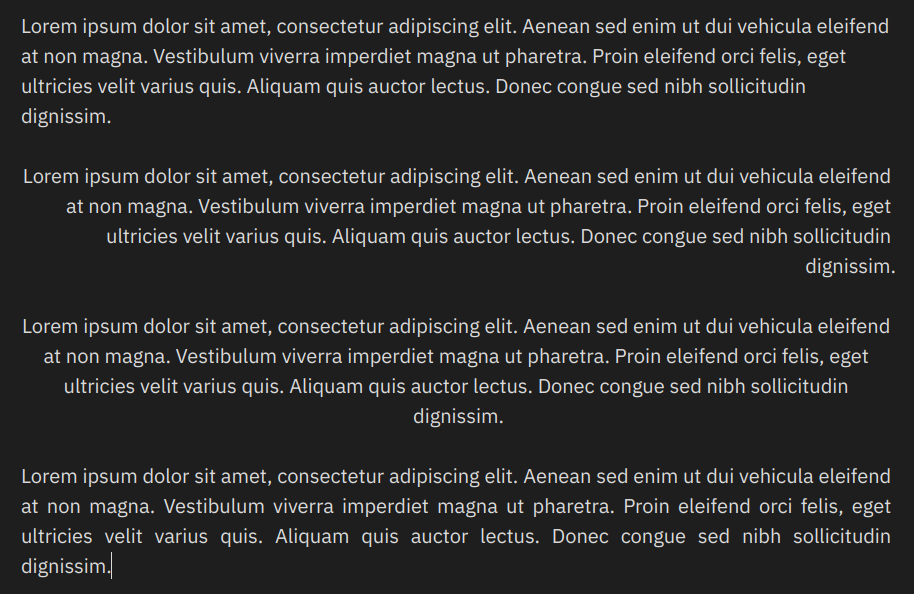

# Extended Markdown Syntax - Obsidian Plugin

This plugin provides some alternatives for inline formatting using non-standard syntaxes instead of using html tags, such as underline, superscript, and much more.

You can easily create text that is <u>underlined</u>, <sup>superscripted</sup>, or <sub>subscripted</sub> without any pain of writing html tags. And don't forget, this plugin supports both modes: editor mode and preview mode.


## Features

This plugin has four main features:

1. Inline formatting (underline, superscript, subscript).
2. Paragraph aligning.
3. Custom highlight color.
4. Discord-flavoured spoiler.

> [!note]
> As it should be, the syntax will not be parsed if it is inside inline-code, codeblock, inline-math, mathblock, and internal links. Instead, they will still be styled by those syntaxes if they are inside them.

### Inline Formatting

| Format      | Delimiter       |
| ----------- | --------------- |
| underline   | `++your text++` |
| superscript | `^your text^`   |
| superscript | `~your text~`   |

You can format text by wrapping it with delimiters.

```markdown
++underline++ ^superscript^ ~subscript~
```

This will result:


You can also combine various formatting without any rendering issues in live-preview mode.:

```markdown
Lorem ++ip*s*um++ dolor sit amet, consectetur adipiscing elit. Aenean sed enim ut dui vehicula **eleifend ++at ~non~++ magna**. Vestibulum viverra imperdiet magna ut pharetra. Proin eleifend orci felis, eget ultricies velit varius quis. Aliquam quis auctor lectus. Donec ~~cong^ue^~~ sed nibh sollicitudin dignissim.
```


Backslash can also be used to escape delimiters, so the text will not be formatted.

```markdown
++will be formatted++ \++will be escaped++ +\+also will be escaped+\+.
```


### Paragraph Aligning

| Align   | Marker      |
| ------- | ----------- |
| left    | `!left!`    |
| right   | `!right!`   |
| center  | `!center!`  |
| justify | `!justify!` |

You can easily set the alignment of a paragraph by writing the aligning-marker at the beginning of the paragraph.

```markdown
!left!Lorem ipsum dolor sit amet, consectetur adipiscing elit. Aenean sed enim ut dui vehicula eleifend at non magna. Vestibulum viverra imperdiet magna ut pharetra. Proin eleifend orci felis, eget ultricies velit varius quis. Aliquam quis auctor lectus. Donec congue sed nibh sollicitudin dignissim.

!right!Lorem ipsum dolor sit amet, consectetur adipiscing elit. Aenean sed enim ut dui vehicula eleifend at non magna. Vestibulum viverra imperdiet magna ut pharetra. Proin eleifend orci felis, eget ultricies velit varius quis. Aliquam quis auctor lectus. Donec congue sed nibh sollicitudin dignissim.

!center!Lorem ipsum dolor sit amet, consectetur adipiscing elit. Aenean sed enim ut dui vehicula eleifend at non magna. Vestibulum viverra imperdiet magna ut pharetra. Proin eleifend orci felis, eget ultricies velit varius quis. Aliquam quis auctor lectus. Donec congue sed nibh sollicitudin dignissim.

!justify!Lorem ipsum dolor sit amet, consectetur adipiscing elit. Aenean sed enim ut dui vehicula eleifend at non magna. Vestibulum viverra imperdiet magna ut pharetra. Proin eleifend orci felis, eget ultricies velit varius quis. Aliquam quis auctor lectus. Donec congue sed nibh sollicitudin dignissim.
```

This will shown as:



Marker can also be applied to headings by placing it after hash marks and space:

```
# !{alignment}!your heading
```


Moreover, markers can also be applied to callouts, both titles and content, and table cells.

```
> [!note] !{alignment}!Your callout title
> !{alignment}!Your callout content

To adjust the alignment of callout title, place alignment marker after callout type identifier (e.g. "[!note]") and space.
```


> [!note]
> For now, I don't include the alignment feature in blockquotes for several reasons.

### Customize Your Highlight Color

You can customize your highlight color simply by adding color tag after opening delimiter with the following format:

```markdown
=={color tag}highlighted text==
```


For the moment, the supported colors are red, orange, yellow, green, cyan, blue, purple, pink (there is also your accent color). If you don't want to use custom colors you can let the highlighted text without color tag (like this: `==default highlighting==`).

```markdown
=={red}Red== =={orange}Orange== =={yellow}Yellow== =={green}Green== =={cyan}Cyan== =={blue}Blue== =={purple}Purple== =={pink}Pink== =={accent}Your accent== ==Default==
```

This will be shown:


Tired of retyping the color tag, you can change the highlight color by hovering over the color button and selecting any color you want (you can also remove the highlight).


### Discord-Flavoured Spoiler

Inspired by discord, you can create **spoilers** by wrapping text with `||`.  In live-preview mode, spoilers can be revealed by hovering over them. Whereas in view mode, spoilers are revealed by clicking on them. Just like previous inline-formatting, the backslash can also be applied to escape delimiters. 

```markdown
||your spoiler||
```


## Features to be Implemented in The Future

- [ ] Enable/disable formatting in settings
- [ ] Customize formatting styles and highlighting colors
- [ ] Applying syntax quickly using shortcuts and context menu
- [ ] More syntaxes, if necessary

## Known Issues

- Cannot escape spoilers that are inside table cells
- The syntax in the heading is treated as normal text in the outline
- Syntax is not properly parsed in post-processed codeblocks such as Admonition

Feel free to let me know if you find any bugs...